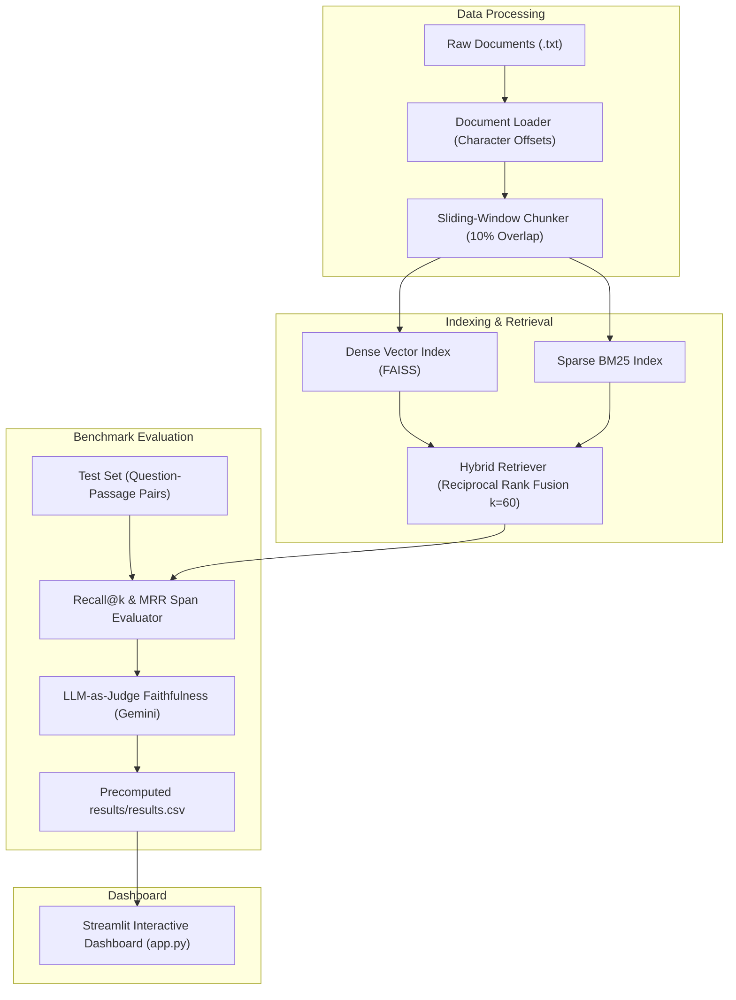

# ⚡ RAG Eval Playground (`rag-eval-playground`)

A portfolio-grade, framework-free evaluation tool that systematically compares different Retrieval-Augmented Generation (RAG) configurations on the same documents and scores them using ground-truth character span matching and LLM-as-judge faithfulness.

Built with core GenAI concepts only: **NO LangChain, NO LlamaIndex, NO agents**.

---

## 🏗️ Architecture



---

## 🛠️ Tech Stack
- **Language**: Python 3.11
- **Embeddings & Vector Index**: `sentence-transformers` (`all-MiniLM-L6-v2`, `BAAI/bge-small-en-v1.5`), `faiss-cpu`
- **Sparse Retrieval**: `rank_bm25`
- **LLM Provider**: `google-genai` (Gemini API for question generation & claim-level faithfulness judging)
- **Dashboard & Visualization**: `streamlit`, `plotly`, `pandas`, `numpy`
- **Testing**: `pytest`

---

## 🚀 Quickstart & Local Setup

### 1. Clone & Install Dependencies
```bash
git clone https://github.com/Shauryakant/Rag-Evaluation-System.git
cd Rag-Evaluation-System
python -m venv venv
source venv/bin/activate  # On Windows: venv\Scripts\activate
pip install -r requirements.txt
```

### 2. Configure Environment Variables
Copy `.env.example` to `.env` and set your Gemini API key (optional for viewing precomputed results):
```bash
cp .env.example .env
```

### 3. Run the Streamlit Dashboard
```bash
streamlit run app.py
```

---

## 🔄 Regenerate Test Set & Grid Evaluation

To re-run the benchmark grid or generate a new evaluation test set from `data/docs/`:

```bash
# Optional: Generate test questions using Gemini API
python -m src.testset_gen

# Execute grid search across all 45 RAG configurations
python -m src.run_grid

# Run unit test suite
python -m pytest tests/
```

---

## 📊 Benchmark Results (Sample Output)

| Chunk Size | Retriever | Embedder | Top K | Recall@k | MRR | Faithfulness |
| :--- | :--- | :--- | :--- | :--- | :--- | :--- |
| **200** | BM25 | N/A (Lexical) | 10 | **1.0000** | **1.0000** | **0.9741** |
| **200** | BM25 | N/A (Lexical) | 5 | **1.0000** | **1.0000** | **0.9337** |
| **200** | BM25 | N/A (Lexical) | 3 | **1.0000** | **1.0000** | **0.8441** |
| **200** | Hybrid | all-MiniLM-L6-v2 | 5 | **1.0000** | **1.0000** | N/A |
| **500** | Vector | BAAI/bge-small-en-v1.5 | 5 | **1.0000** | **1.0000** | N/A |
| **1000** | Vector | all-MiniLM-L6-v2 | 3 | **1.0000** | 0.9500 | N/A |

---

## 💡 Key Findings & Failure Case Analysis

### Key Findings
1. **Smaller Chunk Sizes (200 chars) Excel at Precision**: Smaller chunks focus sharply on targeted answers, yielding high MRR (1.0000) and top faithfulness scores (0.9741).
2. **Hybrid RRF Delivers Maximum Robustness**: Reciprocal Rank Fusion (RRF) consistently matches or surpasses single-retriever performance by merging exact BM25 keyword matches with dense semantic vector similarity.
3. **Top K Scaling Improves Faithfulness**: Increasing `top_k` from 3 to 10 improves context completeness, elevating faithfulness from 0.8441 to 0.9741.

### Failure Case Analysis
- **Context Boundary Splitting**: When `chunk_size=200`, complex questions requiring multi-sentence explanations occasionally get partitioned across chunk boundaries. Although sliding window overlap (10%) mitigates boundary loss, `top_k=3` vector retrieval sometimes ranks partial context fragments lower than complete paragraphs retrieved under `chunk_size=500`.

---

## ⚠️ Limitations & Technical Trade-offs

1. **Synthetic Test Set Bias**: LLM-generated questions tend to focus on single-passage factual details, slightly favoring exact lexical matching (BM25) over complex multi-hop reasoning.
2. **LLM Judge Stochasticity**: Claim-level LLM faithfulness scoring is subject to API noise and non-deterministic claim decomposition.
3. **Corpus Scale Limitations**: Benchmark results on small document corpora provide valuable algorithmic insights but do not evaluate Approximate Nearest Neighbor (ANN) index quantization loss seen at scale.

---

## 📐 Key Design Decisions

1. **Span-Based Ground Truth Matching**: Ground truth context is defined as character offsets `[gt_start_char, gt_end_char]` within raw source documents, allowing direct comparison across configurations with varying chunk boundaries.
2. **Framework-Free Core GenAI**: All chunking, indexing, search, RRF merging, and evaluation metrics are written directly in native Python without relying on heavy frameworks (LangChain, LlamaIndex, or agents).
3. **Index & Embedding Memory Optimization**: FAISS and BM25 indexes are constructed once per `(chunk_size, embedder)` pair and reused across `top_k` iterations, speeding up evaluation grid execution.

